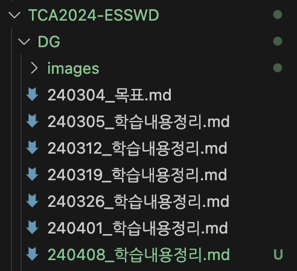

# 3, 4월 회고
 
## 3, 4월 목표

1. Rust official guidebook 완독 -> 1회독 완료

2. 북러닝 완독 및 시험 통과 -> 북러닝(2, 3월) 시험 완료. 책 완독은 못함 

## 활동 내역

주 2회 학습내용 정리 + @(블로그 정리)
- 3월 4일 ~ 4월 8일(6주)

## 회고(개선할 점)

6주짜리 목표 설정은 괜찮게 했다. 목표 두개 모두 러스트 관련이어서 목표 달성하기 어렵진 않았다.

책만 따라가다보니 머리에 많이 남진 않는다. 완독이 목표여서 그런듯하다. 

러스트 공식문서 마지막쯤에 최종 프로젝트 있는데 그거처럼 간단하게 뭘 만들면서 하는게 좋을것같다.

다음 6주 동안은 뭘할지 쉬면서 고민좀 해봐야겠다. 러스트를 할수도 있고 AUTOSAR를 공부할수도 있다. 둘다 섞어서 할수도 있고.