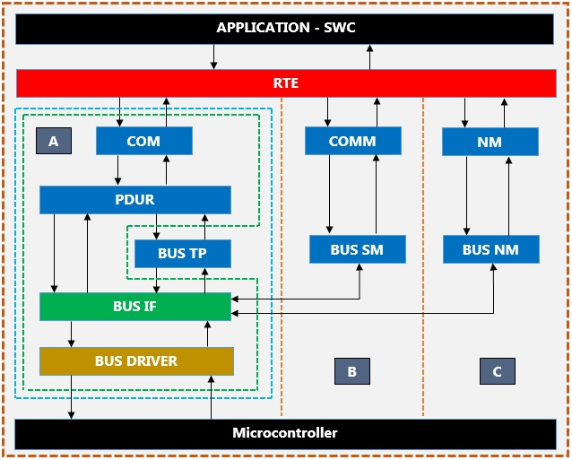

# 240520

AUTOSAR Communication (2)

## What is AUTOSAR Communication Stack(COM STACK)

- COM: Service Layer. 신호 수준의 액세스와 프로토콜(CAN, LIN, 등)과 관계 없이 하위 계층에 대한 PDU 수준 액세스를 제공하는 역할. Transmitter에선 PDU를 압축하고 Reciever에선 PDU를 압축 해제함.
- PDUR: Protocol Data Unit Router. Service Layer이고 COM 보다 하위에 있음. PDU를 특정 인터페이스 모듈로 라우팅함. PDU 레벨의 게이트 웨이로도 사용됨(다른 버스 인터페이스 모듈 간 전송).
- BUS TP: Transport Protocol. 페이로드가 8바이트를 초과하는 메세지를 분할하고 flow control(흐름 제어)를 통해 메세지를 전송하며, 수신기에서 분할된 메세지를 재조립하는 기능을 수행함.
- BUS Interface: ECU abstraction Layer. HAL(Hardware Abstraction Layer)과 Service Layer 간의 인터페이스를 제공함. 전송 요청, 전송 확인, 수신 표시, 컨트롤러 모드 제어 및 PDU 모드 제어와 같은 서비스를 담당함. 
- BUS Drivers: 
  - External Driver: Transceiver의 액세스를 제공함. (하드웨어 독립적인 인터페이스 제공)
  - Internal Driver: 실제 하드웨어 드라이버의 액세스를 제공함. (하드웨어 독립적인 인터페이스 제공)
- BUS SM: State Manager. 버스에 대한 제어흐름 구현. HAL 과 System Service Layer와 상호작용함.
- BUS NM: Network  Manager. 네트워크의 정상 작동(Normal)과 버스 절전 모드(Bus-Sleep) 사이의 전환을 조정함.

## Transfer/Receive Data on CAN Flow

1. Transfer Data
   - ASW - RTE - COM - PduR - CAN TP - CAN IF - CAN Driver - Physical layer
2. Receive Data
   - Physical layer - CAN Driver - CAN IF - CAN TP - PduR - COM - RTE - ASW

* CAN IF 는 데이터 길이가 CAN IF에서 보낼 수 있는 길이(classic can 8, can fd 64)보다 작거나 같을 때 사용되고, CAN TP 는 CAN IF에서 보낼 수 있는 데이터 길이보다 클 때 사용된다.

- 출처: https://automotiveembeddedsite.wordpress.com/communication-stack/