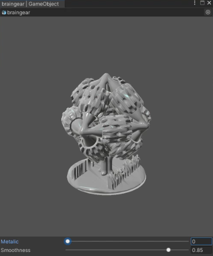

# 240306

## 1. Unity C# 스크립트 개발

-> Asset EditorWindow 및 prefab fbx preview 생성 (데모)

참고자료

https://github.com/anchan828/unity-editor-book-example/blob/master/SpriteAnimationClip/Assets/Editor/SpriteAnimationClipEditor.cs
https://m.blog.naver.com/hammerimpact/220775012493
https://docs.unity3d.com/ScriptReference/Editor.OnInteractivePreviewGUI.html

```cs
//기본 유니티 라이브러리
using UnityEngine;
using UnityEditor;
using UnityEngine.UIElements;
using System.Collections;

//namespace 설정
namespace SmartLibrary
{
    public class EditAssetWindow : EditorWindow
    {
        static public GameObject targetAsset; //preview할 asset
        static public Editor assetEditor; //EditorWindow 오브젝트
        static public Material matAsset; //매터리얼 asset
        static public float val1 = 0.6f; //조정값
        static public float val2 = 0.3f;
        GUIStyle bgColor = new GUIStyle();

        //기본적으로 창 생성 시 Create 를 호출하도록 함.
        public static EditAssetWindow Create(GUID assetid, GUID matid)
        {
            //오브젝트 호출 (유니티는 주로  오브젝트를 GUID 기반 호출 수행)
            string AssetPath = AssetDatabase.GUIDToAssetPath(assetid);
            targetAsset = (GameObject)AssetDatabase.LoadAssetAtPath(AssetPath, typeof(Object));
            
            string MatPath = AssetDatabase.GUIDToAssetPath(matid);
            matAsset = (Material)AssetDatabase.LoadAssetAtPath(MatPath, typeof(Material));


            assetEditor = Editor.CreateEditor(targetAsset);//에셋에 대한 에디터 생성
            //window생성
            var window = CreateWindow<EditAssetWindow>($"{targetAsset.name} | {targetAsset.GetType().Name}");

            //크기 고정
            window.maxSize = new Vector2(500f, 700f);
            window.minSize = window.maxSize;
            return window;
        }

        private void OnGUI()
        {
            //GUI 업데이트
            EditorGUILayout.BeginHorizontal();
            targetAsset = EditorGUILayout.ObjectField(targetAsset, typeof(GameObject), false) as GameObject;
            EditorGUILayout.EndHorizontal();
            //에셋 편집용 오브젝트 필드 설정

            
            if (targetAsset != null)
            {
                if(assetEditor == null)
                {
                    assetEditor = Editor.CreateEditor(targetAsset);
                }
                else
                {
                    assetEditor.OnInteractivePreviewGUI(GUILayoutUtility.GetRect(512, 512), bgColor);
                    //Interactive Preview GUI를 생성함으로써 실시간 렌더링 및 편집 가능
                }
            }
            //Reload를 함으로써, interactive 하지 않아도 화면 갱신하도록 함
            assetEditor.ReloadPreviewInstances();

            //슬라이더 편집 바를 생성
            val1 = EditorGUILayout.Slider("prop1", val1, 0f, 1f);
            val2 = EditorGUILayout.Slider("prop2", val2, 0f, 10f);
            matAsset.SetFloat("_prop1", Metalicval);
            matAsset.SetFloat("_prop2", Smoothval);
        }
    }
}

```

결과

